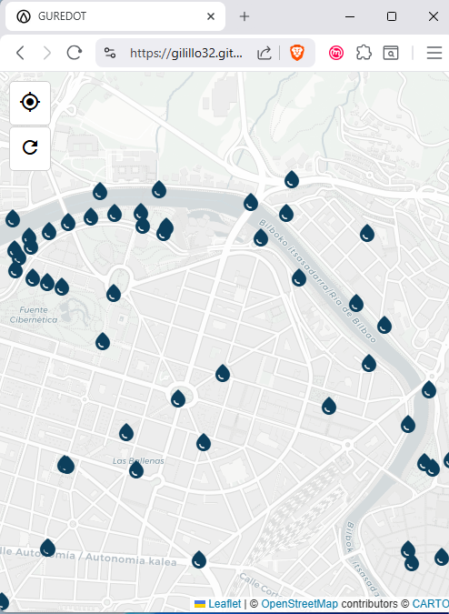

# GUREDOT

### **EUSK**  

Noizbait kalean egon zara esan duzu **"pf, ure gudot"**.  
Edo turismoa egiten ibili zara eta ur-iturri bat bilatu behar izan duzu?  
Ez kezkatu, GUREDOT-ek lagunduko dizu zure inguruan ur-iturriak bilatzen.  

---

### **GAZT**  

¿Alguna vez has estado andando por la calle muriéndote de sed y necesitabas encontrar una fuente?  
¿O has estado haciendo turismo, te ha entrado la sed y has necesitado encontrar una fuente cerca de ti?  
No te preocupes, GUREDOT te ayuda a encontrar fuentes de agua potable cerca de ti.

